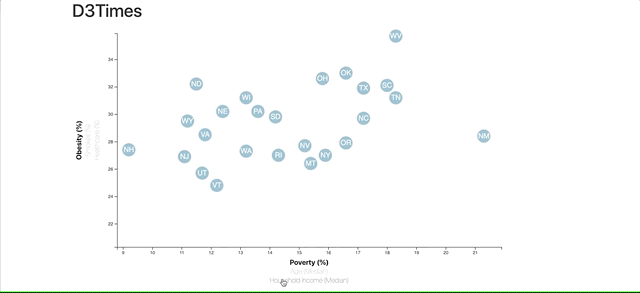

# D3-Scatter-Plot
This is an example of the use of d3, html, JavaScript, excel, and css. This takes data from American FactFinder and compares Healthcare vs. Poverty and Smokers vs. Age in a scatter plot with animations provided by d3.

If receiving CORS errors running locally, in command line at folder where html is stored run python -m http.server